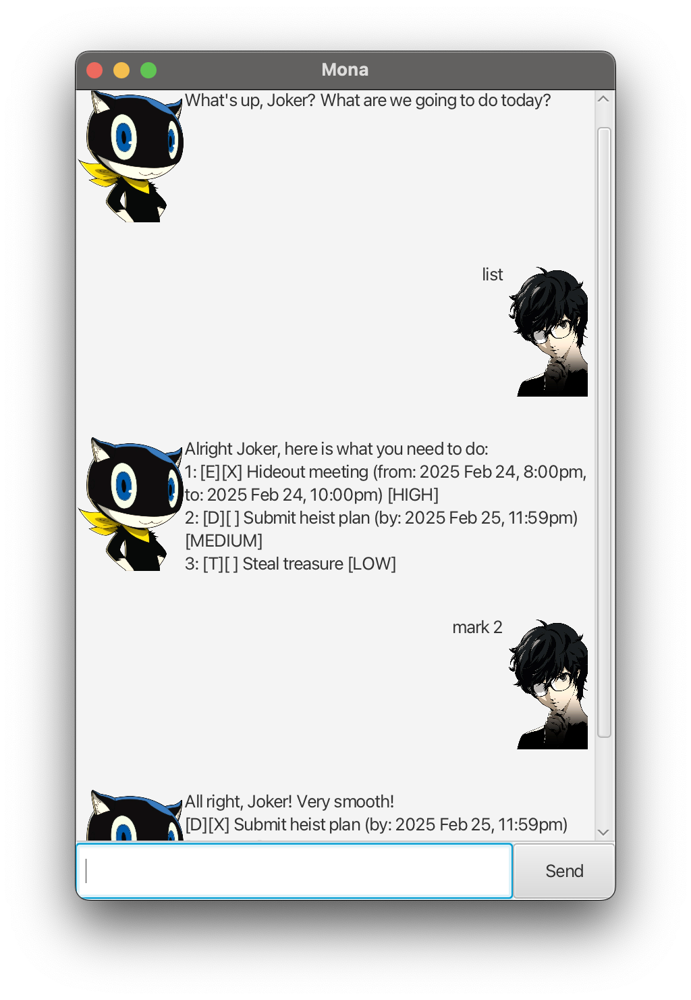

# Mona User Guide



*“What’s up, Joker? What are we going to do today?”*

## Introduction
**Mona** is your intelligent **task manager chatbot**, designed to help you track your tasks in a fun and interactive way—*Phantom Thief style!*  
Whether you're adding **To-Dos**, setting **Deadlines**, or scheduling **Events**, Mona’s got your back!

## Quick Start
1. Ensure you have **Java 17 or later** installed.
2. Download the latest **Mona.jar** from [here](https://github.com/WilkinsAng/ip/releases/download/A-UserGuide/Mona-v0.9.jar).
3. Place the file in your desired **working directory**.
4. Run the application using: `java -jar Mona.jar`
5. A GUI will appear. Mona will greet you and is ready to take your commands!

## Features

###  Adding a To-Do Task
Creates a simple task with a description.

*Note: All tasks are set to a default priority of `LOW`.*
#### **Format:**
```plaintext
todo <Description>
```
#### **Example:**
- `todo Steal treasure `
- `todo Buy Curry Ingredients`

#### **Expected Output:**
```plaintext
Got it, Joker! I'll help you remember to:
[T][ ] Buy groceries [LOW]
Don't forget, you have 1 tasks now.
```

###  Adding a Deadline Task
Creates a task with deadline.

#### **Format:**
```plaintext
deadline <Description> /by <Date: dd mmm yyyy Time: 12hr format + am/pm (12:00am)>
```

#### **Example:**
- `deadline Submit heist plan /by 25 Feb 2025 11:59pm`
- `deadline Submit report /by 20 Feb 2025 11:59pm`

#### **Expected Output:**
```plaintext
Got it, Joker! I'll help you remember to:
[D][ ] Submit report (by: 20 Feb 2025 11:59pm) [LOW]
Don't forget, you have 2 tasks now.
```

###  Adding an Event Task
Creates a task with a start and end date-time.

#### **Format:**
Date format is the same as deadlines.
```plaintext
event <Description> /from <Start Date> /to <End Date>
```

#### **Example:**
- `event Project meeting /from 6 Aug 2025 2:00pm /to 6 Aug 2025 4:00pm`
- `event Phantom Thieves Meeting /from 10 Sep 2025 9:00am /to 10 Sep 2025 5:00pm`

#### **Expected Output:**
```plaintext
Got it, Joker! I'll help you remember to:
[E][ ] Phantom Thieves Meeting (from: 6 Aug 2025 2:00pm, to: 6 Aug 2025 4:00pm) [LOW]
Don't forget, you have 3 tasks now.
```

###  Viewing All Tasks
Displays all of your tasks. 

#### **Format:**
```plaintext
list
```

#### **Expected Output:**
```plaintext
Alright Joker, here is what you need to do:
1: [T][ ] Buy groceries [LOW]
2: [D][ ] Submit report (by: 20 Feb 2025 11:59pm) [LOW]
3: [E][ ] Phantom Thieves Meeting (from: 6 Aug 2025 2:00pm, to: 6 Aug 2025 4:00pm) [LOW]
```

### Marking a Task as Done
Marks a specified task as completed.

#### **Format:**
```plaintext
mark <Task Number>
```

#### **Example:**
- `mark 1`
- `mark 2`

#### **Expected Output:**
```plaintext
All right, Joker! Very smooth!
[T][X] Buy groceries [LOW]
```

### Unmarking a Task
Marks a specified task as not completed.

```plaintext
mark <Task Number>
```

#### **Example:**
- `unmark 1`
- `unmark 2`

#### **Expected Output:**
```plaintext
What?! You changed your mind, Joker...?!
[T][] Buy groceries [LOW]
```

### Deleting a Task
Deletes a specified task from your list.

#### **Format:**
```plaintext
delete <Task Number>
```

#### **Example:**
- `delete 1`
- `delete 2`

#### **Expected Output:**
```plaintext
Task #2 has been erased from existence, Joker!
 [D][ ] Submit report (by: 20 Feb 2025 11:59pm) [LOW]
won't be bothering us anymore!
Don't forget, you have 2 tasks now.
```

### Finding a Task
Searches for a task containing the specified keywords.
Can have multiple keywords separated by spaces.

#### **Format:**
```plaintext
find <Keyword> <Keyword> ...
```

#### **Example:**
- `find project`
- `find project phantom`

#### **Expected Output:**
```plaintext
HaHA! A flawless search, executed purrfectly!
Here are the results for "phantom", Joker!:
1: [E][ ] Phantom Thieves Meeting (from: 6 Aug 2025 2:00pm, to: 6 Aug 2025 4:00pm) [LOW]
```

### Prioritizing a Task
Changes the priority of a specified task.
```
prioritize <Task Number> <Priority (1-HIGH, 2-MEDIUM, 3-LOW)>
```

#### **Example:**
- `prioritize 1 1`
- `prioritize 2 2`

#### **Expected Output:**
```plaintext
Meow-ha! Task:
 [T][ ] Submit report (by: 20 Feb 2025 11:59pm) [HIGH]
is now at HIGH priority! Better get to it before it becomes a real heist!
```

### Exiting Mona
This command is now obsolete. It just says goodbye and does nothing.
Please close the winder manually.

#### **Format:**
```plaintext
bye
```

#### **Expected Output:**
```plaintext
We should get ready for tomorrow. Goodnight, Joker. Meowww.
You can close me now!
```